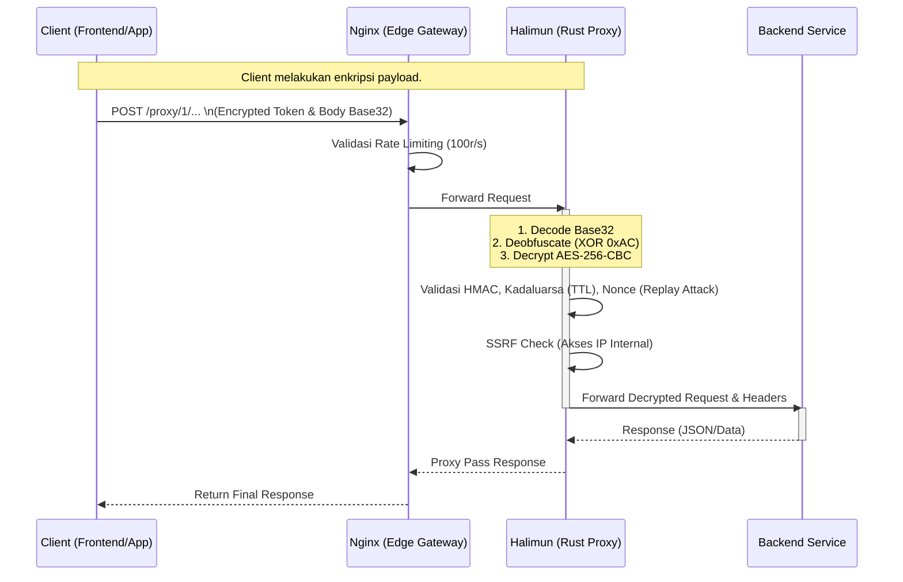
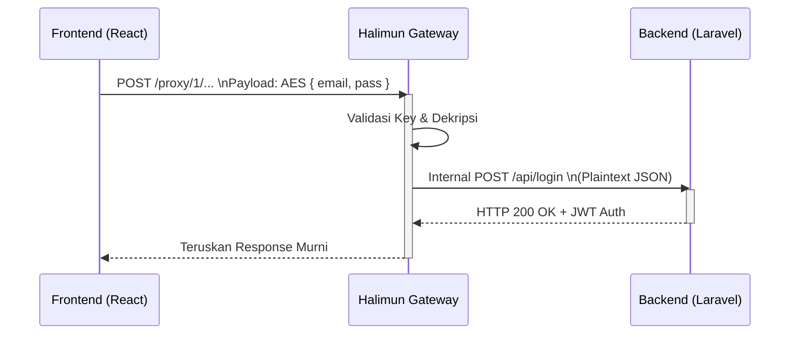
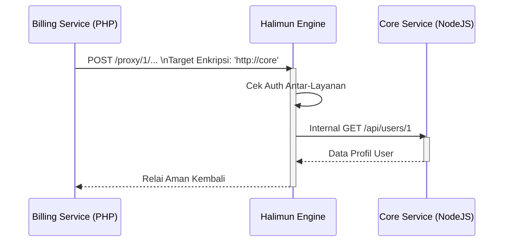
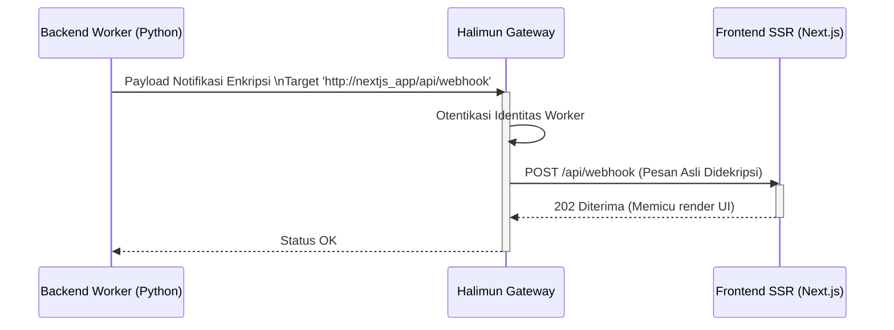
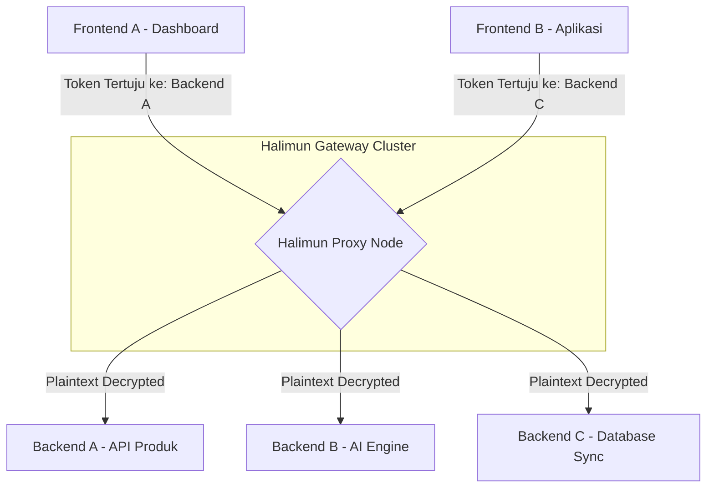

# Halimun: High-Performance Encrypted Proxy

*Baca ini dalam bahasa lain: [English](README.md), [Bahasa Indonesia](README.id.md).*

Halimun (sebelumnya Latebra) adalah proxy tunnel asinkronus ultra-cepat berbasi Rust. Proyek ini menggunakan **Axum** dan **Tokio** untuk memberikan perutean multi-microservice tanpa hambatan (non-blocking) di atas sebuah saluran terenkripsi AES-256-CBC yang dibalut cek integritas HMAC dan perlindungan replay attack melalui nonce.

Library ini dirancang agar dapat membuka sistem publik dengan aman, tanpa mengorbankan privasi isolasi antar layanan mikro internal Anda di dalam sebuah environment Private Docker Network.

---

## 🏗️ Architecture & Cara Kerja

Halimun bekerja sebagai sebuah penengah (gateway) yang mendekripsi permintaan aman dari sisi publik, memvalidasi otentikasinya, memfilter trafik jahat, dan meneruskannya ke spesifik backend. 



---

## 🚀 Instalasi & Setup (menggunakan Docker)

Halimun dirancang sedemikian rupa agar sangat ringan dan sangat mudah dideploy dengan footprint serendah ~15MB memori melalui Docker Alpine.

### 1. Persiapan Config & Kunci Enkripsi

Lakukan _clone_ repository, lalu salin berkas _template_:
```bash
cp config.example.yaml config.yaml
cp .env.example .env
```

Untuk menjamin keamanan, Anda **wajib** mengubah Kunci Enkripsi menjadi acak. Kami sudah menyediakan *generator* bawaan dari library ini. Bangun _image_ sistem Anda dan perintahkan pembuatan kunci sekali waktu:
```bash
# 1. Build Halimun Rust Image
docker build -t halimun-proxy .

# 2. Extract Konfigurasi Kunci Enkripsi
docker run --rm halimun-proxy ./halimun-proxy --keygen --format=env > .env
```
_Silakan salin nilai-nilai yang ada di `.env` yang baru terbuat tersebut dan sematkan ke dalam file `config.yaml` Anda pada bagian `encryption:`._

### 2. Mengaktifkan Server (Deployment Produksi)

Setelah kredensial Anda dan file `config.yaml` siap, hal yang perlu Anda kerjakan hanyalah mengeksekusinya memakai Docker Compose:
```bash
docker-compose up -d
```
Trafik produksi Anda kini dapat didengarkan secara aman lewat Port `80` localhost Anda!

---

## 🔐 Manajemen Dashboard & Keamanan 

Sistem secara terpisah menyediakan UI Administrator di:
**http://localhost/dashboard/**

- Nginx mengotentikasi login ke Dashboard melalui **Basic HTTP Auth**.
- Username default: `admin`
- Password default: `admin123`

*(Untuk mengganti Password, Anda dapat membuat file `.htpasswd` baru dengan format utilitas Apache maupun Nginx, dan memasukannya ke file konfigurasi `nginx/.htpasswd`.)*

Pada Dashboard ini, Anda dapat:
- Melihat **Live Traffic Logs** (Siapa, Tujuan mana, Latensi ms, dll).
- Melihat layanan (Backend API) mana saja yang telah diregistrasi.
- **Generate API Keys** secara on-the-fly yang bisa disinkronisasikan instan ke frontend.

---

## 💻 Panduan Penggunaan (*Mengirim Request Enkripsi*)

Halimun menggunakan protokol Kriptografi Simetris AES-256-CBC, dibungkus dalam *Anti-Pattern* XOR rotasi sederhana, dan diterjemahkan via *Custom Base32*. Setiap SDK Anda di Front-End / bahasa pemrograman di Backend tidak terkunci pada tools khusus; *library* standar bisa mengatasi perhitungan tersebut.

Berikut adalah format *Request* URL dan *Body*:
```text
POST /proxy/1/:segmen_1/:segmen_2/:segmen_3/:segmen_4/:segmen_5
Content-Type: application/x-www-form-urlencoded

x=ENCRYPTED_BODY_BASE32
```
_Catatan: Salah satu segment url diatas berisi Decrypted Token asli. Sisanya merupakan teks palsu untuk kamuflase._

### Integrasi JavaScript / TypeScript (Frontend / React / Vue)
Anda dapat menggunakan SDK JS Standar seperti `crypto-js` di *browser*. 

```javascript
import CryptoJS from 'crypto-js';

// Kunci ini harus sama persis dengan backend proxy (.env)
const AES_KEY = CryptoJS.enc.Hex.parse(process.env.HALIMUN_AES_KEY);
const JSON_PAYLOAD = JSON.stringify({ email: "user@example.com", auth: true });

// Tahap 1: Enkripsi Standar
const iv = CryptoJS.lib.WordArray.random(16);
const encrypted = CryptoJS.AES.encrypt(JSON_PAYLOAD, AES_KEY, {
    iv: iv,
    mode: CryptoJS.mode.CBC,
    padding: CryptoJS.pad.Pkcs7
});

// Tahap 2: Gabungkan byte IV dan Ciphertext (Ini membutuhkan fungsi parser word-array spesifik)
const combinedBytes = iv.concat(encrypted.ciphertext);

// Tahap 3: Implementasikan Algoritma XOR Obfuscation (0xAC rotate left) & Encode base32-halimun...
// (Anda dapat mengkonversi fungsi Obfuscation Rust kedalam helper TypeScript sederhana)
```

### Integrasi PHP Backend (Laravel / Symfony)
Jika Anda adalah microservice sisi lain yang menyuplai proxy request ke Halimun:

```php
$aesKey = hex2bin(env('HALIMUN_AES_KEY'));
$iv = random_bytes(16);

// Enkripsi Cepat AES-256-CBC
$encrypted = openssl_encrypt(
    json_encode($data), 
    'aes-256-cbc', 
    $aesKey, 
    OPENSSL_RAW_DATA, 
    $iv
);

// Pasang IV Ke Depan Array
$finalBytes = $iv . $encrypted;

// Terapkan XOR Array Logic seperti di Halimun Rust / Latebra lama.
```

## 🔄 Contoh Alur Penggunaan Menyeluruh (End-to-End)

### 1. Frontend ke Backend (Client mengirim request data)
*Skenario: Aplikasi React mengirimkan formulir Login ke API Laravel.*



### 2. Backend ke Backend (Komunikasi Antar Microservice)
*Skenario: Microservice Pembayaran (PHP) perlu menarik data Profile User dari Microservice Inti (NodeJS).*



### 3. Backend ke Frontend (SSR atau Notifikasi Webhook)
*Skenario: Sebuah Background Worker selesai memproses video (selesai dirender) lalu mengabari server Frontend SSR (Next.js) lewat Webhook.*



### 4. Multi-Backend & Multi-Frontend Hub Routing
*Skenario: Halimun bertindak sebagai penghubung (Gateway) pusat yang mengelola belasan microservice. `config.yaml` memetakan berbagai URL berbeda, dan Halimun langsung menyalurkannya secara dinamis ke target yang tertulis di dalam token.*



---

## 📄 Lisensi

Proyek ini bersifat *Open Source* di bawah lisensi **MIT License**.
Lihat berkas [LICENSE](LICENSE) atau kunjungi [Muhammad-Ikhwan-Fathulloh/Halimun-Proxy](https://github.com/Muhammad-Ikhwan-Fathulloh/Halimun-Proxy) untuk detail lebih lanjut.
