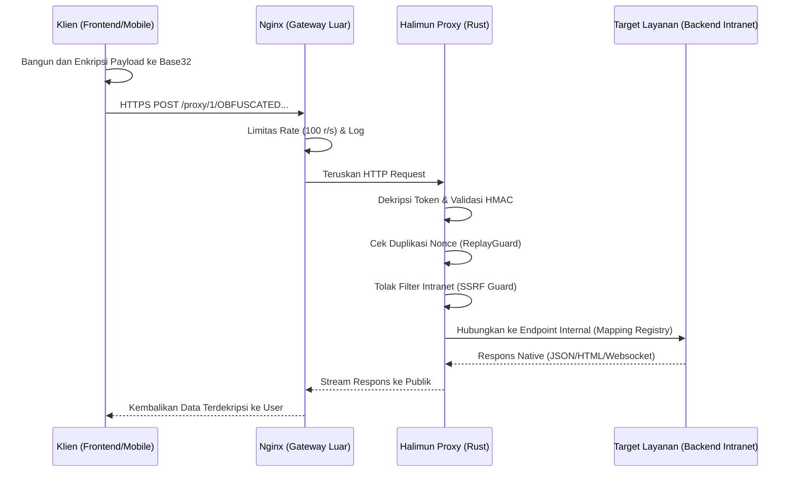
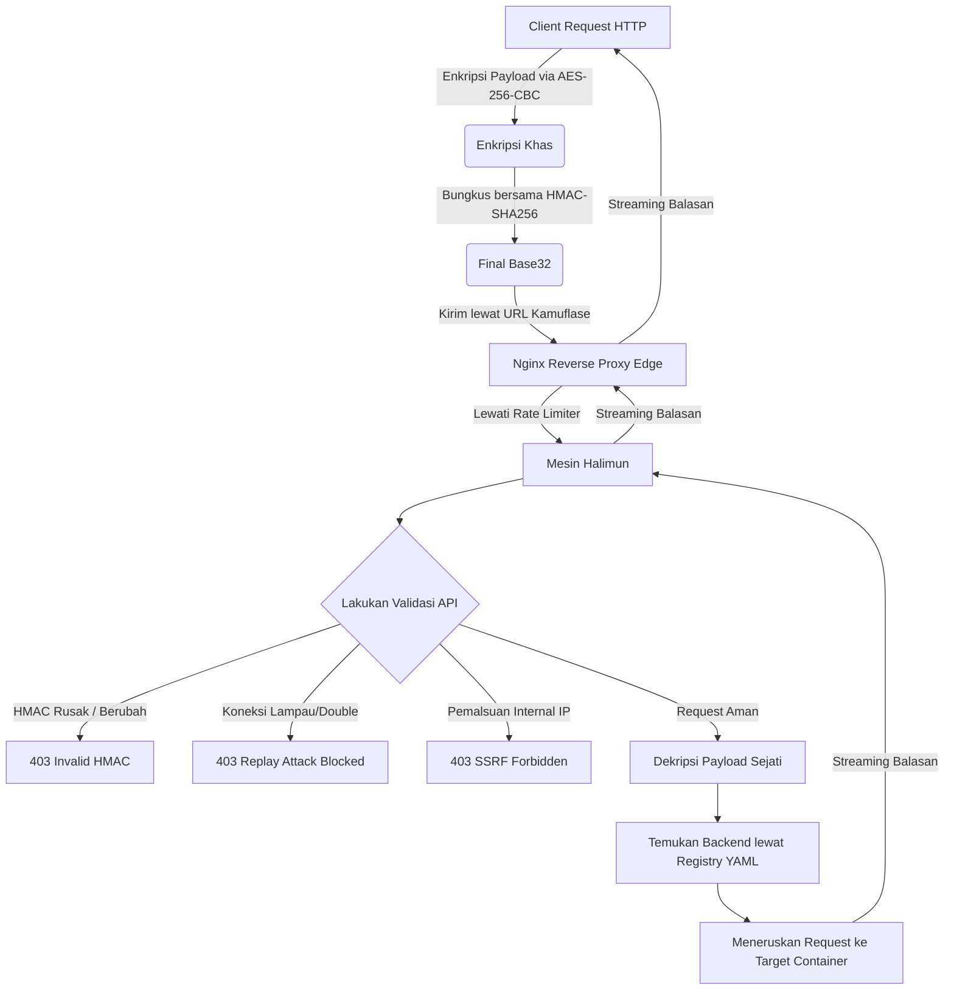

# Halimun: High-Performance Encrypted Proxy

*Baca ini dalam bahasa lain: [English](README.md), [Bahasa Indonesia](README.id.md).*


[](https://github.com/Muhammad-Ikhwan-Fathulloh/Halimun-Proxy/actions)
[](https://opensource.org/licenses/MIT)

## 📌 Gambaran Umum
Halimun adalah proxy tunnel asinkronus ultra-cepat berbasi Rust. Proyek ini mengenkripsi request dari ujung ke ujung menggunakan enkripsi AES-256-CBC, memvalidasinya dengan perlindungan integritas HMAC-SHA256, dan mencegah serangan duplikasi ulang menggunakan sistem perlindungan Nonce.

Dibangun di atas pilar **Axum** dan **Tokio**, Halimun memberikan lajur microservice multi-tenant yang tangguh, membiarkan Anda membuka gerbang keamanan murni secara publik, seraya menyembunyikan service internal secara terisolasi ke dalam Private Docker.

---

## 🚀 Quick Start (Docker)

Halimun dirancang sedemikian rupa agar sangat ringan dengan konsumsi memori serendah ~15MB melalui _container_ Docker Alpine.

**1. Persiapan Config & Kunci Enkripsi**
Lakukan clone dan gunakan _generator_ untuk mencipta Environment aman secara acak:
```bash
cp .env.example .env

# Gunakan Image Docker untuk melakukan compile dan mencetak kunci Kriptografi
docker build -t halimun-proxy .
docker run --rm halimun-proxy ./halimun-proxy --keygen --format=env > .env
```
Salin data di dalam `.env` yang baru terbuat tersebut dan masukkan ke dalam `config.yaml` Anda.

**2. Jalankan Cluster Produksi**
```bash
docker-compose up -d
```
*Trafik produksi Anda kini dapat didengarkan secara aman lewat Port `80` sementara target sistem internal Anda disembunyikan rapat-rapat!*

---

## 🏗️ Struktur Arsitektur

Bagian ini memodelkan letak proxy di dalam infrastruktur Anda. Halimun berada di tengah antara Nginx (dunia luar) dan Microservice (dunia internal).



### 🧠 Konsep Lengkap Penggunaannya

Siklus sebuah Request yang ditangani Halimun melewati berbagai pos perlindungan berikut ini:



Konsep kunci dalam ekosistem Halimun Proxy:
1. **End-to-End Payload Hiding**: Payload utama dan endpoint API target `dirahasiakan` sejak di perangkat Front-end klien. 
2. **Kekebalan Replay Guard**: Setiap payload memiliki **Nonce** dan **Timestamp** yang dimasukkan ke basis memori (DashMap) Halimun. Jika ada penyerang menyalin request yang persis sama, request tersebut akan dibunuh di gerbang.
3. **URL Kamuflase**: Halimun tak pernah memakai nama target API secara aslinya, melainkan memakai deretan huruf acak. Hal ini menyulitkan Web Application Firewall (WAF) atau analis peretas saat membaca profil trafik Anda.

### Tatanan Source Code
```text
halimun-proxy/
├── src/
│   ├── crypto/            # Kernel Enkripsi: AES-CBC, HMAC-SHA256, XOR, Custom Base32
│   ├── token/             # Representasi Payload Token dan Validasi
│   ├── security/          # Laju Batas Permintaan & Pertahanan SSRF
│   ├── services/          # Dynamic Routing Registry, Pengawasan API & Logger
│   ├── proxy/             # Mesin HTTP Handler (Axum Proxy)
│   └── main.rs            # Entrypoint Inisiasi
├── dashboard/             # Antarmuka Admin GUI (HTML & Glassmorphism UI)
├── nginx/                 # Konfigurasi Pertahanan Gerbang Tepi
├── examples/              # Contoh SDK Client Eksternal untuk Python, Go, Node.js dll
├── Dockerfile             # Multi-stage Rust to Alpine
└── config.yaml            # Pemetaan target rute API
```

---

## 📦 Skema Token & Payload

Hatimun menyamarkan Request lewat URL Kamuflase. Setiap koneksi berwujud:

**Struktur URL:**
```text
POST /proxy/1/SEGMEN_1/SEGMEN_2/SEGMEN_3/SEGMEN_4/SEGMEN_5
```
Hanya salah satu dari Segmen URL Path di atas yang membawa identitas rahasia, sedangkan segmen-segmen lainnya diisi otomatis oleh data acak secara _random_ untuk mengecoh analisa pola penyerang.

**Form Request Parameter (URL Encoded):**
```text
POST /proxy/1/XYZ...
Content-Type: application/x-www-form-urlencoded

x=ENCRYPTED_BODY_BASE32
```

### Contoh Permintaan Utuh (Raw Network)
```http
POST /proxy/1/VQYXGZL.../KQXGYZTP.../JNZWQ4T.../AB4XGZLWF.../KQXG... HTTP/1.1
Host: domain-anda.com
Content-Type: application/x-www-form-urlencoded

x=JZSWY3DQEA5GQZJY4TSSEBQWFI7DKCJRFYYDELJYJ5HE2LMMZ2HU6DTPN5G...
```

### Breakdown Payload Token (Apabila didekripsi)
Di dalam parameter `x=` dan `url_segment`, sistem akan membongkarnya menjadi instruksi:
```json
{
  "api_url": "http://backend_target:80/api/auth/login",
  "api_header": {
    "Authorization": "Bearer TOKEN|ID",
    "Content-Type": "application/json"
  },
  "method": "POST",
  "timestamp": 1715517600,
  "expired": 300,
  "offset": "+00:00",
  "nonce": "550e8400-e29b-41d4-a716-446655440000",
  "hmac": "8f14e45fceea167a5a36dedd4bea2543fd7144c883569d94a7350eca6d47161"
}
```

### Response Flow & Error Status
Bila sukses, Halimun akan mem-bypass balasan kemurnian milik Backend tanpa mengubah apapun (Bisa berwujud JSON, XML, Video Stream, dll).

Namun, bila Request itu bermasalah, Halimun secara tangkas membunuhnya di garis terdepan:
* Manipulasi Enkripsi (400): `{ "error": "Decryption failed: invalid token...", "code": 400 }`
* Payload Diretas/Diubah (403): `{ "error": "Invalid HMAC", "code": 403 }`
* Serangan Duplikasi Nonce (403): `{ "error": "Nonce replayed", "code": 403 }`
* Target Mengarahkan ke IP Local Intranet (SSRF Blok) (403): `{ "error": "Forbidden: Cannot proxy to internal addresses", "code": 403 }`

---

## 🛡️ Standar Pertahanan Siber
- ✅ **AES-256-CBC Encryption** - Mekanisme kriptografi simetris paling stabil.
- ✅ **HMAC-SHA256** - Menjaga kesatuan payload; bila 1 karakter dimodifikasi hacker, HMAC gagal total.
- ✅ **Nonce Memory Storage** - Mencegah pesan lama diulang (_Replay Guard_).
- ✅ **SSRF Protection** - Memblokir keras permintaan yang mencoba mencari tau IP Intranet (`192.168.x`).
- ✅ **Rate Limiting Ganda** - Pembatasan beban permintaan di Handle secara simultan via Nginx dan Sistem Rust.
- ✅ **Custom Obfuscation (XOR)** - Algoritma rotasi bit tambahan menggunakan Base32 tanpa bantalan (Unpadded).

---

## 🤖 Analytics Dashboard
Halimun dibekali GUI Administratif ringan (*Glassmorphism Design*) yang berdiri sendiri tanpa _framework npm_ rumit. 
Kunjungi **`http://localhost/dashboard/`** (Kredensial Default Nginx Auth: `admin/admin123`)

Fitur utama Dashboard:
1. **Live Traffic Logs**: Memantau Request rute dan latensi detik itu juga.
2. **Registry Hub**: Mengamati kemana Microservice ini saling tertuju secara arsitektur.
3. **Key Exchange**: Mencetak paket AES Key dari jarak jauh.

---

## 🧪 Tahapan Testing

### 1. Unit Tests (Murni Rust)
Bila PC Anda terinstal konfigurasi _Rust Toolchain_ (`cargo`), silakan jalankan simulasi algoritma kriptografi lengkap:
```bash
cargo fmt && cargo clippy -- -D warnings
cargo test 
```

### 2. Standalone Code Execution
Menyalakan perute program tanpa memuat konfigurasi YAMl/Nginx:
```bash
cargo run --example standalone_proxy
```
Silakan lihat implementasi Klien (_Frontend & Backend Integration SDKs_) Python, Go, Node.js, dan PHP bersemayam di dalam direkotri **`examples/clients/`**.

---

## 📚 Referensi & Inspirasi

Halimun dibangun dengan ide dan inspirasi yang diambil dari proyek-proyek open-source luar biasa berikut ini:

| Proyek                                                    | Deskripsi                                                                                   | Stack         |
| --------------------------------------------------------- | ------------------------------------------------------------------------------------------- | ------------- |
| [Latebra](https://github.com/exphert/Latebra)             | Proxy terenkripsi dengan AES-256-CBC, HMAC-SHA256, dan pencegahan serangan replay via nonce | PHP / Laravel |
| [rathole](https://github.com/rathole-org/rathole)         | Reverse proxy berkinerja tinggi untuk NAT traversal dengan enkripsi Noise Protocol & TLS    | Rust          |
| [frp](https://github.com/fatedier/frp)                    | Fast reverse proxy mendukung TCP/UDP/HTTP/HTTPS dengan enkripsi TLS                         | Go            |
| [Ghostunnel](https://github.com/ghostunnel/ghostunnel)    | Proxy TLS sederhana dengan autentikasi mutual TLS (mTLS) untuk mengamankan backend non-TLS  | Go            |
| [rustunnel](https://github.com/joaoh82/rustunnel)         | Server tunnel self-hosted yang mengekspos layanan lokal via WebSocket terenkripsi TLS       | Rust          |
| [Proxytunnel](https://github.com/proxytunnel/proxytunnel) | Tool klasik untuk tunneling koneksi melalui proxy HTTP(S) dengan SSL/TLS                    | C             |
| [RustCrypto](https://github.com/RustCrypto)               | Ekosistem primitif kriptografi Rust yang diaudit komunitas (AES, HMAC, SHA2, dll.)          | Rust          |

---

## 📄 Lisensi
Proyek ini bersifat *Open Source* di bawah lisensi **MIT License**.
Lihat berkas [LICENSE](LICENSE) atau kunjungi [Muhammad-Ikhwan-Fathulloh/Halimun-Proxy](https://github.com/Muhammad-Ikhwan-Fathulloh/Halimun-Proxy) untuk detail lebih lanjut.
