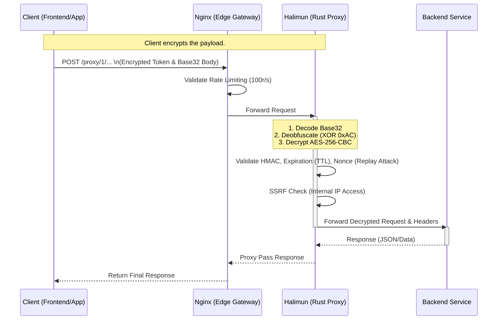
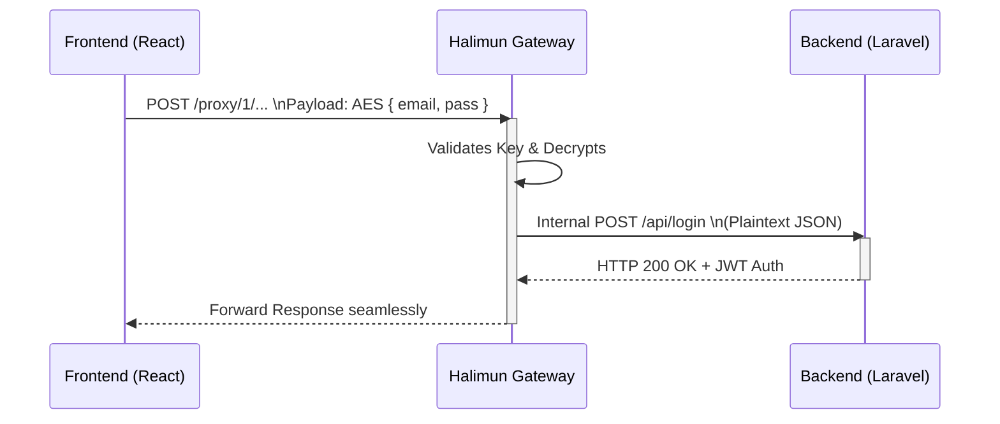
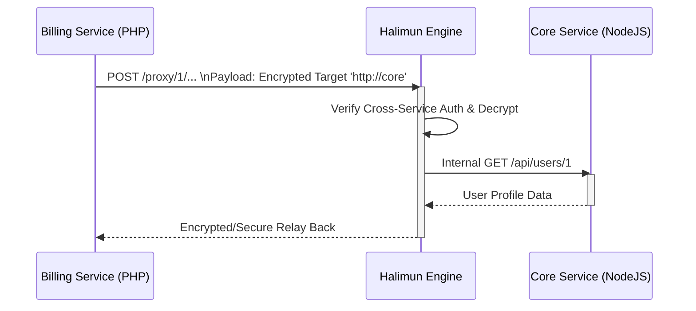
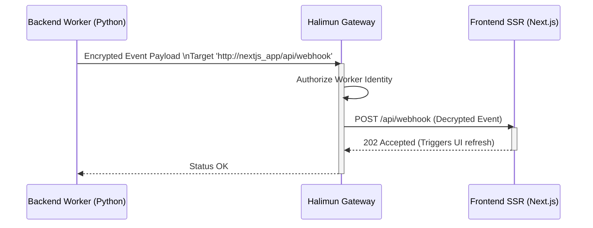
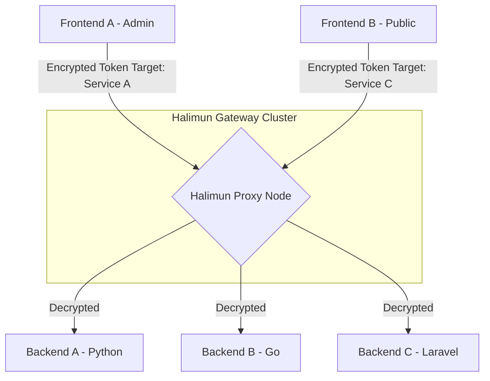

# Halimun: High-Performance Encrypted Proxy

*Read this in other languages: [English](README.md), [Bahasa Indonesia](README.id.md).*


[](https://github.com/Muhammad-Ikhwan-Fathulloh/Halimun-Proxy/actions)
[](https://opensource.org/licenses/MIT)

Halimun (formerly Latebra) is a high-performance, ultra-low latency proxy tunnel written in Rust. It utilizes **Axum** and **Tokio** to provide non-blocking asynchronous multi-microservice routing over an AES-256-CBC encrypted tunnel with HMAC integrity checks and nonce replay protection. 

It is designed to cleanly expose an encrypted public gateway while keeping your internal microservices completely secluded within a private Docker network.

---

## 🏗️ Architecture & Workflow

Halimun acts as a gateway that decrypts secure requests from the public side, validates authentication, filters malicious traffic, and forwards it to specific backend endpoints.



---

## 🚀 Quick Start (Docker)

Halimun is designed to be extremely lightweight and very easy to deploy with a memory footprint as low as ~15MB using Docker Alpine.

**Spin everything up instantly with:**
```bash
docker-compose up -d
```
*Your production proxy is now securely listening on port `80` while hiding internal systems!*

### 1. Configuration & Encryption Keys Setup

Clone the repository, then copy the template files:
```bash
cp config.example.yaml config.yaml
cp .env.example .env
```

To guarantee absolute security, you **must** change the Encryption Keys to random values. We provide a built-in key generator through the library CLI. Build your system image and execute the key generator command:
```bash
# 1. Build Halimun Rust Image
docker build -t halimun-proxy .

# 2. Extract Encryption Key Configuration
docker run --rm halimun-proxy ./halimun-proxy --keygen --format=env > .env
```
_Please copy the values from the newly created `.env` file and insert them into your `config.yaml` file under the `encryption:` section._

### 2. Live Re-Deployment

Once your keys are safely inserted back into `config.yaml`, restart the proxy node:
```bash
docker-compose restart halimun-proxy
```

---

## 🔐 Dashboard Management & Security 

The system provides an isolated Administrator UI at:
**http://localhost/dashboard/**

- Nginx authenticates Dashboard logins via **Basic HTTP Auth**.
- Default Username: `admin`
- Default Password: `admin123`

*(To change the Password, you can create a new `.htpasswd` file using Apache or Nginx utilities and insert it into the `nginx/.htpasswd` configuration file.)*

On this Dashboard, you can:
- View **Live Traffic Logs** (Incoming requests, Targets, Latency in ms, etc).
- See which services (Backend APIs) are currently registered.
- **Generate API Keys** on-the-fly that can be instantly synchronized to the frontend.

---

## 💻 Usage Guide (*Sending Encrypted Requests*)

Halimun utilizes Symmetric Cryptography (AES-256-CBC), wrapped in a simple anti-pattern rotation (XOR), and mapped via Custom Base32. Your Front-End SDKs or Backend languages are not reliant on specific tooling; standard libraries are capable of computing these requirements natively.

Below is the Request URL and Body format:
```text
POST /proxy/1/:segment_1/:segment_2/:segment_3/:segment_4/:segment_5
Content-Type: application/x-www-form-urlencoded

x=ENCRYPTED_BODY_BASE32
```
_Note: One of the URL segments above contains the original Decrypted Token. The rest are dummy strings for camouflage._

### Integration via JavaScript / TypeScript (Frontend / React / Vue)
You can utilize standard JavaScript SDKs like `crypto-js` on the browser.

```javascript
import CryptoJS from 'crypto-js';

// The key must match the proxy backend (.env) exactly
const AES_KEY = CryptoJS.enc.Hex.parse(process.env.HALIMUN_AES_KEY);
const JSON_PAYLOAD = JSON.stringify({ email: "user@example.com", auth: true });

// Step 1: Standard Encryption
const iv = CryptoJS.lib.WordArray.random(16);
const encrypted = CryptoJS.AES.encrypt(JSON_PAYLOAD, AES_KEY, {
    iv: iv,
    mode: CryptoJS.mode.CBC,
    padding: CryptoJS.pad.Pkcs7
});

// Step 2: Combine IV and Ciphertext bytes (requires word-array manipulation)
const combinedBytes = iv.concat(encrypted.ciphertext);

// Step 3: Implement XOR Obfuscation (0xAC rotate left) & Base32-Halimun encoding...
// (You can port the Rust Obfuscation function to a typescript helper script)
```

### Integration via PHP Backend (Laravel / Symfony)
If you operate another microservice providing proxy requests to Halimun:

```php
$aesKey = hex2bin(env('HALIMUN_AES_KEY'));
$iv = random_bytes(16);

// Express AES-256-CBC Encryption
$encrypted = openssl_encrypt(
    json_encode($data), 
    'aes-256-cbc', 
    $aesKey, 
    OPENSSL_RAW_DATA, 
    $iv
);

// Prepend IV to Array
$finalBytes = $iv . $encrypted;

// Apply XOR Logic array matching the Halimun Rust implementation.
```

## 🔄 End-to-End Example Flows

### 1. Frontend to Backend (Client submitting data)
*Scenario: A React frontend sends a login request to a Laravel backend.*



### 2. Backend to Backend (Microservice to Microservice)
*Scenario: A Billing Microservice (PHP) needs to request User Details from a Core Microservice (NodeJS).*



### 3. Backend to Frontend (SSR or Webhooks)
*Scenario: A Backend worker finished processing a video and notifies a Next.js Server-Side Rendering (SSR) frontend or sends Webhooks back to client infrastructure.*



### 4. Multi-Backend & Multi-Frontend Hub Routing
*Scenario: Halimun acts as a central hub managing dozens of microservices. The `config.yaml` maps distinct URLs, and Halimun dynamically routes them based on the `target_url` in the decrypted token.*



---

## 🗺️ Roadmap

We are constantly aiming to improve Halimun's routing bounds. Planned features include:
- [ ] **Native Redis Clustering**: Transitioning from single-node `DashMap` nonce tracking to a distributed Redis backend for large-scale microservice replication.
- [ ] **Advanced Telemetry**: Standardized integration with Prometheus & Grafana to expand the current Glassmorphism logging dashboard.
- [ ] **Dynamic Key Exchange**: Auto-rotating TTL secret negotiation to avoid relying heavily on static Environment Variables.

---

## 📄 License

This project is open-sourced under the **MIT License**.
See the [LICENSE](LICENSE) file or visit [Muhammad-Ikhwan-Fathulloh/Halimun-Proxy](https://github.com/Muhammad-Ikhwan-Fathulloh/Halimun-Proxy) for more details.