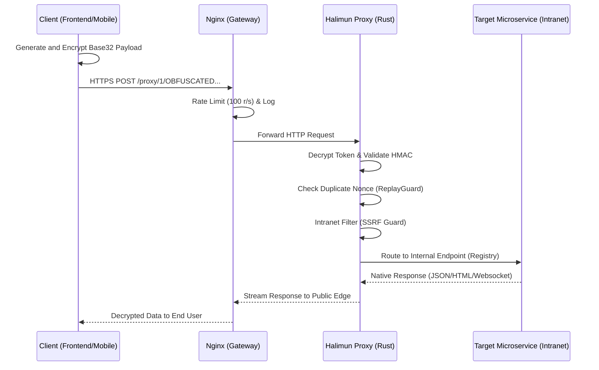
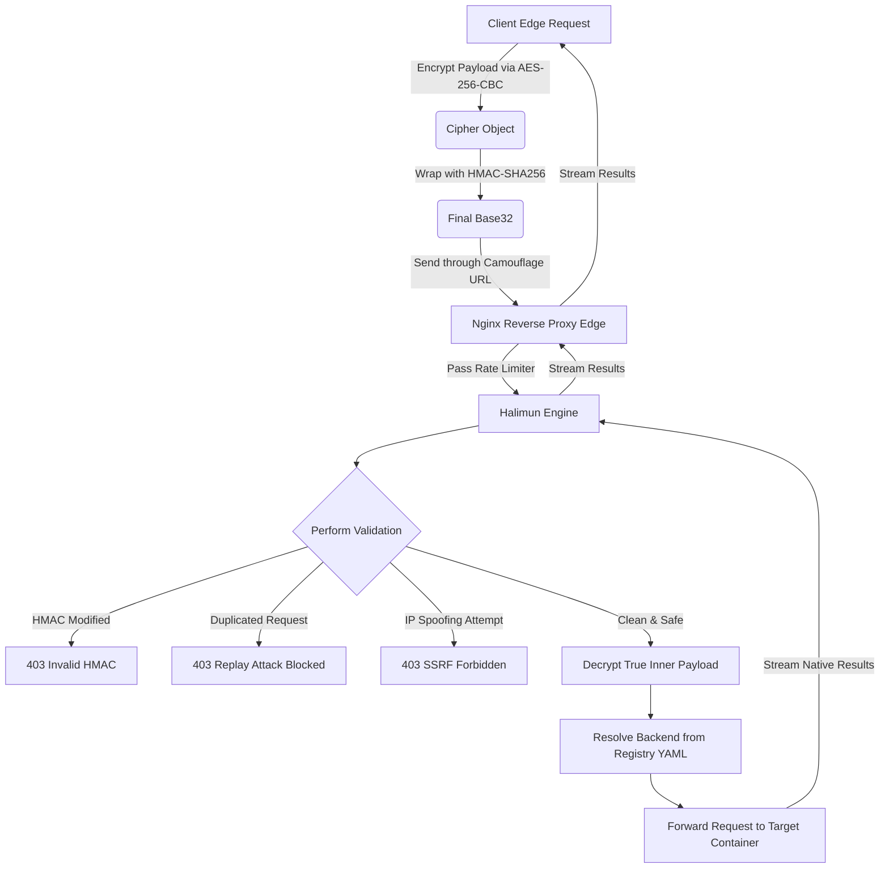

# Halimun: High-Performance Encrypted Proxy

*Read this in other languages: [English](README.md), [Bahasa Indonesia](README.id.md).*


[](https://github.com/Muhammad-Ikhwan-Fathulloh/Halimun-Proxy/actions)
[](https://opensource.org/licenses/MIT)

## 📌 Overview
Halimun (formerly Latebra) is a high-performance, ultra-low latency proxy tunnel system written in Rust. It encrypts requests end-to-end using AES-256-CBC encryption with HMAC-SHA256 integrity protection and replay attack prevention (via Nonces). 

Utilizing **Axum** and **Tokio**, Halimun provides non-blocking asynchronous routing to seamlessly expose an encrypted public gateway while keeping internal microservices completely secluded within a private Docker network.

---

## 🚀 Quick Start (Docker)

Halimun is designed to be extremely lightweight (~15MB RAM) via Docker Alpine.

**1. Configuration**
Copy the environment template and generate encryption keys natively:
```bash
cp .env.example .env

# Generate keys using Halimun's isolated keygen
docker build -t halimun-proxy .
docker run --rm halimun-proxy ./halimun-proxy --keygen --format=env > .env
```
Copy your `.env` contents to `config.yaml` to configure target IPs and backend maps.

**2. Start the Cluster**
```bash
docker-compose up -d
```
*Your production proxy is now securely listening on port `80` while hiding internal systems!*

---

## 🏗️ Architecture Layout

This section models how the proxy is placed within your infrastructure. Halimun stands as a gateway boundary line between the outside internet (via Nginx) and your isolated microservices.



### 🧠 Complete Usage Concepts

The lifecycle of a single request handled by Halimun goes through these strict verification posts:



Key Concepts within the Halimun Proxy Ecosystem:
1. **End-to-End Payload Hiding**: The primary HTTP payload and the actual API endpoint address are strongly `encrypted` straight from the client's frontend device.
2. **Replay Guard Immunity**: Every encrypted token brings a **Nonce** and a **Timestamp** parameter verified in-memory by Halimun (DashMap). Thus, identical spoofed curl requests recorded by bad actors will instantly be rejected at the gateway.
3. **Camouflage URLs**: Halimun never exposes the authentic service names or routing patterns, substituting them entirely with random segments to hinder Web Application Firewalls (WAF) or human analysts from profiling your traffic.

### File Structure
```text
halimun-proxy/
├── src/
│   ├── crypto/            # AES-CBC, HMAC-SHA256, XOR, Custom Base32
│   ├── token/             # Token payloads, validation, ReplayGuard
│   ├── security/          # Rate Limiting & SSRF internal IP blocking
│   ├── services/          # Dynamic Routing Registry, Health, Logging
│   ├── proxy/             # Core Axum HTTP Handler
│   └── main.rs            # Application Bootstrapper
├── dashboard/             # Glassmorphism HTML/JS Admin UI
├── nginx/                 # Edge Gateway Configs (.htpasswd)
├── examples/              # Cross-Language client integration SDKs
├── Dockerfile             # Multi-stage minimal compiler
└── config.yaml            # Environment and route definitions
```

---

## 📦 Request & Token Format

Halimun proxies requests through an encrypted tunnel using camouflage URL paths. Each request consists of:

**URL Structure:**
```text
POST /proxy/1/SEGMENT1/SEGMENT2/SEGMENT3/SEGMENT4/SEGMENT5
```
Where one segment contains the genuine encrypted target parameters, while others are dummy segments used for pattern obfuscation.

**Request Body (URL Encoded):**
```text
POST /proxy/1/XYZ...
Content-Type: application/x-www-form-urlencoded

x=ENCRYPTED_BODY_BASE32
```

### Raw Request Example
```http
POST /proxy/1/VQYXGZL.../KQXGYZTP.../JNZWQ4T.../AB4XGZLWF.../KQXG... HTTP/1.1
Host: your-server.com
Content-Type: application/x-www-form-urlencoded

x=JZSWY3DQEA5GQZJY4TSSEBQWFI7DKCJRFYYDELJYJ5HE2LMMZ2HU6DTPN5G...
```

### Token Payload Breakdown (Decrypted)
Inside the `x=` payload is a decrypted structure representing:
```json
{
  "api_url": "http://backend_target:80/api/auth/login",
  "api_header": {
    "Authorization": "Bearer TOKEN|ID",
    "Content-Type": "application/json"
  },
  "method": "POST",
  "timestamp": 1715517600,
  "expired": 300,
  "offset": "+00:00",
  "nonce": "550e8400-e29b-41d4-a716-446655440000",
  "hmac": "8f14e45fceea167a5a36dedd4bea2543fd7144c883569d94a7350eca6d47161"
}
```
The actual body is attached securely to this object.

### Response Formats
When successful, Halimun natively streams the response from the Target API exactly as provided.

**Error Responses:**
Invalid Encryption / Manipulated (400)
```json
{ "error": "Decryption failed: invalid token or key mismatch", "code": 400 }
```
HMAC Validation Failed / Modified Data (403)
```json
{ "error": "Invalid HMAC", "code": 403 }
```
Replay Attack Detected (403)
```json
{ "error": "Nonce replayed (Duplicated Request)", "code": 403 }
```
SSRF Loop Blocked (403)
```json
{ "error": "Forbidden: Cannot proxy to internal addresses directly", "code": 403 }
```

---

## 🛡️ Security Features & Considerations

- ✅ **AES-256-CBC Encryption** - Military-grade symmetric packet masking.
- ✅ **HMAC-SHA256** - Strictly validates message integrity and origin.
- ✅ **Nonce Validation (In-Memory)** - Drop duplicate identical payloads instantly.
- ✅ **SSRF Protection** - Prevents rogue users from targeting `127.0.0.1` or `192.168.x`.
- ✅ **Rate Limiting** - Bucket limiters applied both natively (Rust) and via Nginx (`100 r/s`).
- ✅ **Custom Obfuscation** - Pattern hiding via Base32 un-padded XOR 0xAC rotations.

**Considerations:**
- ⚠️ Never share encryption keys.
- ⚠️ Ensure AES keys are exactly `64 hex characters (32 bytes)`.
- ⚠️ Rotate keys frequently using the Admin Dashboard.
- ⚠️ Always place Halimun behind the bundled Nginx configuration for dual-protection.

---

## 🤖 Analytics Dashboard
Halimun features an isolated, framework-free Glassmorphism Administrator UI at:
**`http://localhost/dashboard/`** (Secured via Nginx basic auth: `admin/admin123`)

It acts as a control center where you can view:
1. **Live Traffic Logs**: Watch connections routed to backend containers.
2. **Registry Hub**: Overview active mapping destinations.
3. **Key Exchange**: Rotate encryption credentials remotely.

---

## 🧪 Testing

### 1. Unit Tests (Rust)
If you have local rust (`cargo`) installed, run:
```bash
# Formats and validates
cargo fmt && cargo clippy -- -D warnings
# Runs HMAC, Encryption, and Decryption mathematics tests natively
cargo test 
```

### 2. Standalone Examples
Run the raw library programmatically without needing `config.yaml` or Nginx:
```bash
cargo run --example standalone_proxy
```
For native Frontend and Backend code implementation patterns, review the full setups at **`examples/clients/`** (Provides Python, Go, Node.js, and PHP implementations).

---

## 📄 License
This project is open-sourced under the **MIT License**.
See the [LICENSE](LICENSE) file or visit [Muhammad-Ikhwan-Fathulloh/Halimun-Proxy](https://github.com/Muhammad-Ikhwan-Fathulloh/Halimun-Proxy) for more details.